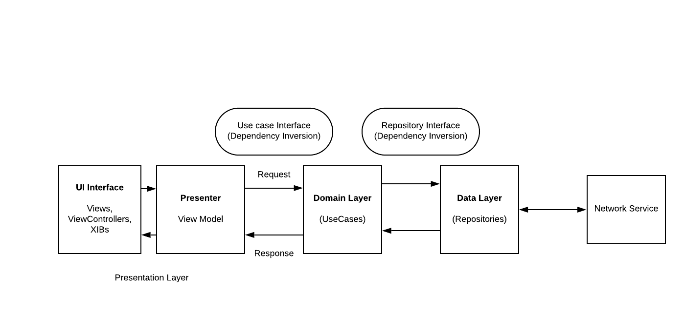

# MVVM-FlickrImageSearch
Search for images with a keyword using MVVM Clean architecture
=============

- You can search for images using a keyword and it will diplay those images on your screen
- No third party library has been used
- *URLSession* is used for Networking
- *NSCache* is used for caching imaghes
- *MVVM Clean architecture* is used along with *Repository Pattern*
- *Dependency Injection Container* is used to manage all the dependencies in the app
- *Data Binding* is achieved using generics and closures
- *Unit Testing* is also implemented

## Contents

If you are looking for something specific, you can jump right into the relevant section from here.

1. [Getting Started](#getting-started)
2. [Project Structure](#project-structure)
3. [Architecture](#architecture)
4. [Unit Tests](#unit-tests)

## Getting Started

### System requirements
    • Xcode v11.4 beta and above
    • Swift 5

### Installation
    • Install Xcode v11.4 beta
    • Clone the project
    • Go to Project root folder and type: 'open FlickrImageSearch.xcodeproj'

## Project Structure
   <h3 align="center">
  
  </h3>

## Architecture
  • MVVM Clean architecture is followed along with Repository Pattern
   <h3 align="center">
   
   </h3>

## Unit Tests
  Press Cmd+U in your Xcode to run all the tests. The following files have been unit tested with 100% code coverage
  
    • ImagesSearchViewModelTests
    • ImageSearchUseCaseTest
    • ImagesSearchRepositoryTest
    • NetworkServiceTests
